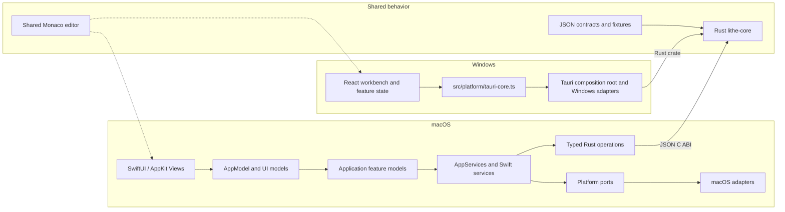

<div align="center">
  

  <h1>Lithe</h1>

  <p><strong>A low-memory IntelliJ IDEA alternative for Java development and AI collaboration</strong></p>

  <p>
    <a href="./README.zh-CN.md"><strong>简体中文</strong></a> ·
    <a href="#core-features">Core features</a> ·
    <a href="#product-tour">Product tour</a> ·
    <a href="#download-and-install">Download</a> ·
    <a href="https://1lck.github.io/Lithe-IDEA/">Decision board</a> ·
    <a href="#develop-lithe">Develop Lithe</a>
  </p>

  <p>
    <a href="https://hellogithub.com/repository/1lck/Lithe-IDEA" target="_blank"></a>
    <a href="https://atomgit.com/lithe_IDEA/Lithe-IDEA"></a>
    <a href="https://trendshift.io/repositories/124763?utm_source=trendshift-badge&amp;utm_medium=badge&amp;utm_campaign=badge-trendshift-124763" target="_blank" rel="noopener noreferrer"></a>
  </p>

  <p>
    <a href="https://github.com/1lck/Lithe-IDEA/releases/latest"></a>
    <a href="https://github.com/1lck/Lithe-IDEA/releases"></a>
    
    
    
    <a href="#download-and-install"></a>
    <a href="./LICENSE"></a>
  </p>
</div>

https://github.com/user-attachments/assets/17e2325b-afed-4bbb-9926-a962f777269b

## Join the community

Welcome to join the Lithe community, share your experience, ask questions, and follow the latest updates.

<div align="center">
<table>
  <tr>
    <th>QQ group</th>
    <th>WeChat group</th>
  </tr>
  <tr>
    <td align="center"><a href="https://qm.qq.com/cgi-bin/qm/qr?k=&amp;group_code=163027877"></a></td>
    <td align="center"><a href="https://gcnctzuuwe9u.feishu.cn/wiki/HJFbwZ0hZirAPnkWF3xcPWkCnid?from=from_copylink"></a></td>
  </tr>
</table>
</div>

If you cannot scan the WeChat QR code, [click here to join through Feishu](https://gcnctzuuwe9u.feishu.cn/wiki/HJFbwZ0hZirAPnkWF3xcPWkCnid?from=from_copylink).

## Why Lithe

Codex, Claude Code, and other AI coding tools can now handle much of the implementation work. Developers still need an IDE to understand the generated code, follow symbols, run and debug the project, and review every diff. Keeping a heavyweight development environment open for those tasks can mean several gigabytes of resident memory.

## Meet Lithe

Lithe is a lightweight IntelliJ IDEA alternative built first for Java and Spring Boot developers. It keeps the core workflows for browsing, editing, navigation, search, Maven, run and debug, Git diff review, local history, and databases.

The Lithe application typically uses about **300–400 MB of baseline memory** after opening a regular project. Language servers, terminals, build tools, debuggers, and database helpers start on demand. Actual usage varies with the project and active services.

> **AI writes the code. Lithe helps you understand it, run it, and review it.**

## If macOS says it cannot open `Lithe.app`

If macOS says that Apple cannot verify whether `Lithe.app` contains malware, the manually downloaded package may not yet be notarized by Apple. First confirm that the app came from the trusted [GitHub Releases](https://github.com/1lck/Lithe-IDEA/releases/latest), then use one of these methods:

<p align="center">
  
</p>

1. In **Applications**, Control-click `Lithe.app`, choose **Open**, and choose **Open** again in the confirmation dialog.
2. If macOS still blocks it, open **System Settings > Privacy & Security**, click **Open Anyway** next to the security warning, and launch the app again.
3. You can also remove the quarantine attribute in Terminal:

   ```bash
   sudo xattr -dr com.apple.quarantine /Applications/Lithe.app
   ```

Only use these steps for an app whose source you trust. Homebrew installations usually do not require manual quarantine removal.

## Core features

<details>
<summary>Expand core features</summary>

1. Built for Spring Boot projects and Java development.
2. Maven management, breakpoint debugging, and custom run configurations.
3. Git management and side-by-side diff review.
4. Double-Shift search and `Command + Shift + F` project-wide search.
5. Process-free lightweight completion and current-file navigation, with on-demand language servers for richer completion, hover, and semantic navigation.
6. Local snapshot history.
7. Multiple projects open within the app.
8. Multiple files open independently in the same window.
9. AI-generated commit messages with customizable formats.
10. Rich Markdown rendering consistent with Yuque syntax.
11. Local application memory usage monitoring.
12. One-command installation and updates through Homebrew.
13. One-click in-app updates and installation.
14. Automatic project entry-point detection with one-click run support for Spring Boot, Java, Maven, Gradle, npm, Cargo, Go, Python, Make, Docker Compose, Procfile, and shell projects.
15. Per-language service switches so language servers can be enabled or disabled independently to match the machine's resources.
16. Multi-line editor tabs for keeping more files visible in the same workspace.
17. Database connection workspace with multiple database types, connection management, SQL history, table browsing, and database operations.
18. Ongoing bug fixes and user experience improvements.

</details>

## Product tour

<p align="center">
  
  
</p>

<p align="center">
  
  
</p>

<details>
<summary>More screenshots</summary>
<br>

<p align="center">
  
  
</p>

<p align="center">
  
  
</p>

<p align="center">
  
  
</p>

<p align="center">
  
  
</p>

<p align="center">
  
  
</p>

<p align="center">
  
</p>

</details>

## Download and install

- **macOS 13+:** Download the `arm64` DMG for Apple silicon or the `x86_64` DMG for Intel Macs from [GitHub Releases](https://github.com/1lck/Lithe-IDEA/releases/latest).
- **Windows x64:** Download the Windows `.exe` installer from [GitHub Releases](https://github.com/1lck/Lithe-IDEA/releases/latest).

Homebrew is the recommended installation and update method on macOS:

```bash
brew tap 1lck/lithe https://github.com/1lck/Lithe-IDEA.git
brew install --cask 1lck/lithe/lithe
brew upgrade --cask lithe
```

## Architecture Overview

macOS is the current reference product. Windows is an independent React/Tauri implementation. Both products share deterministic commands and contracts through Rust Core while keeping native UI and platform integrations separate.



<details>
<summary><strong>Develop Lithe</strong></summary>


Development and CI use Swift 6.3.3, pinned in `.swift-version`, with Xcode 26.6. Running the complete test suite requires Xcode; basic SwiftPM builds only need matching Command Line Tools. Developers using Xcode 27 may also build locally; the macOS 27 SDK compatibility path is detected by the build scripts. `Package.swift` keeps its Swift 6.2 manifest API minimum; this does not select the compiler version.

Run the development build from the repository root:

```bash
./scripts/preview.sh
```

The script builds and links Rust Core before launching the macOS app. To validate only the Swift source, run:

```bash
swift run --disable-sandbox Lithe
```

Build an app bundle:

```bash
./scripts/package-app.sh
open dist/Lithe.app
```

Before submitting a change, run:

```bash
./scripts/test-macos.sh
./scripts/test-git-performance-baseline.sh
./scripts/verify-core.sh
./scripts/verify-git-graph.sh
./scripts/verify-service-boundaries.sh
./scripts/verify-shared-contracts.sh
./scripts/verify-windows-boundaries.sh
./scripts/verify-rust-core.sh
```

`test-git-performance-baseline.sh` runs deterministic Git graph work gates and
records an optimized multi-sample timing baseline under `.artifacts/`.

See [Repository ownership and sharing boundaries](./.agents/notes/implemented/architecture/2026-09-13-repository-ownership-and-sharing-boundaries.md) for directory ownership, cross-platform boundaries, sharing rules, and the required Rust Core comment standard. Include your verification steps and known limitations when submitting a change.

</details>

## Project support

### ❤️ Sponsors

<p align="center">
  <a href="https://www.fastaitoken.com/">
    
  </a>
</p>
<p align="center">
  <a href="https://www.fastaitoken.com/"><strong>FastAI</strong></a><br>
  FastAI provides convenient relay access to a range of leading large language models, making it easier to connect AI capabilities to everyday development workflows. Its support helps Lithe continue improving its AI-assisted experience. Thank you to FastAI for supporting this project! Scan the QR code above to join the FastAI Token community chat group #2 (group ID: 1073874006).
</p>

<a href="mailto:2188718831@qq.com">Want to be featured below?</a>

<table>
  <tr>
    <td width="112" align="center">
      <a href="https://www.fastaitoken.com/">
        
      </a>
    </td>
    <td>
      <a href="https://www.fastaitoken.com/"><strong>FastAI</strong></a> provides convenient relay access to a range of leading large language models, making it easier to connect AI capabilities to everyday development workflows. Its support helps Lithe continue improving its AI-assisted experience. Thank you to FastAI for supporting this project!
    </td>
  </tr>
  <tr>
    <td width="112" align="center">
      <a href="https://www.packyapi.ai/register?aff=dWNN">
        
      </a>
    </td>
    <td>
      <a href="https://www.packyapi.ai/register?aff=dWNN"><strong>PackyCode</strong></a> is a stable, efficient API relay service that connects you to leading large language models. It offers a unified domain, a single API key, intelligent failover, and 97% availability. Top up in RMB at a 1:1 rate with no exchange-rate costs or transaction fees. New users receive a first-top-up discount plus $1 in free trial credit. Discounts across multiple service groups reach up to 80% off, with dedicated high-speed channels for Codex and Claude Code.<br>
      <a href="https://www.packyapi.ai/register?aff=dWNN">Register to get started!</a>
    </td>
  </tr>
  <tr>
    <td width="112" align="center">
      <a href="https://torchai.ai/sign-up?aff=FdkE">
        
      </a>
    </td>
    <td>
      <a href="https://torchai.ai/sign-up?aff=FdkE"><strong>TorchAI</strong></a> provides large language model relay services for developers who need convenient API access across coding, content, and automation scenarios. Its support helps sustain Lithe's development and exploration of practical AI-powered tools. Thank you to TorchAI for supporting this project!
    </td>
  </tr>
  <tr>
    <td width="112" align="center">
      <a href="https://www.atlascloud.ai/zh">
        
      </a>
    </td>
    <td>
      <a href="https://www.atlascloud.ai/zh"><strong>Atlas Cloud</strong></a> provides AI model relay services with access to <strong>over 400 models</strong>. Its broad model selection gives developers more options to explore, compare, and choose models for their applications through one platform. Thank you to Atlas Cloud for supporting Lithe and the continued improvement of its AI-assisted development experience!
    </td>
  </tr>
  <tr>
    <td width="112" align="center">
      <a href="https://codezsy.com/register?aff=fDyA">
        
      </a>
    </td>
    <td>
      <a href="https://codezsy.com/register?aff=fDyA"><strong>CodeZ</strong></a> focuses on stable relay access to GPT-family models, offering developers a straightforward way to integrate model APIs into their tools and projects. Its sponsorship contributes to the ongoing development and maintenance of Lithe. Thank you to CodeZ for supporting this project!
    </td>
  </tr>
  <tr>
    <td width="112" align="center">
      <a href="https://app.rainyun.com/apps/rcs/392785/detail?view=info">
        
      </a>
    </td>
    <td>
      <a href="https://app.rainyun.com/apps/rcs/392785/detail?view=info"><strong>RainYun (雨云)</strong></a> offers cloud servers for deploying applications, hosting websites, and running development and test environments. Thank you to RainYun for supporting Lithe and its continued development!
    </td>
  </tr>
</table>

### ☕ Support Lithe

If Lithe is useful to you, you are welcome to buy the project a cup of coffee. Every contribution will be put back into Lithe's continued development and maintenance.

<div align="center">
<table>
  <tr>
    <td align="center">
      <br>
      <strong>WeChat</strong>
    </td>
    <td align="center">
      <br>
      <strong>Alipay</strong>
    </td>
  </tr>
</table>
</div>

### ⭐ Special thanks

<p align="center">
  <a href="https://linux.do/">
    
  </a>
</p>

<p align="center">
  <strong>For all things AI, head to <a href="https://linux.do/">LINUX DO</a>. Wishing the community ever greater success.</strong>
</p>

### Contributors

Thank you to everyone who contributes to and improves Lithe.

<a href="https://github.com/1lck/Lithe-IDEA/graphs/contributors">
  
</a>

### License

Lithe is licensed under the [Apache License 2.0](./LICENSE).

## Star History

<a href="https://www.star-history.com/#1lck/Lithe-IDEA&Date">
  
</a>
